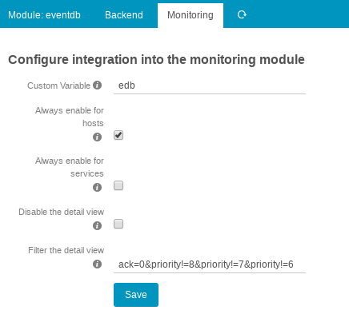

Configuration
=============

## Database Resource

To let the module know where the events are stored you have to create an SQL
database resource, with the EventDB schema, and events collected by EventDB.

Access to the EventDB for the module is handled with normal Icingaweb2 resources.

Create the resource and go to the config area to select it:

    Configuration -> Modules -> Eventdb -> Backend
    

## Monitoring Integration

The EventDB module integrates into Icinga Web 2's monitoring module by default,
offering action links in host and service detail views.

### Default actions

By default, every host and services shows an action link to the event list, 
filtered by host name.

### Custom Variable

You can configure a custom variable that enables the integration selectively.

* `_edb` or `vars.edb` will enable the actions only on objects that have the custom var
* `_edb_filter` or `vars.edb_filter` allows you to pre-filter the linked events

The name of the customvar (`edb`) needs to be configured in the config area of the module.

Also see [Custom Variables](03-CustomVars.md) documentation.

### Always show actions

There are options to always show actions on host or service, even if the custom variable
is not set.

### Detail view

Icingaweb adds a new feature in 2.5.0 to allow extra content inside the detail views
of hosts and services.

By default the view filters for not acknowledged events, and shows you the last, most
critical events first. One can jump to events list or a detail view immediately.

Custom filters can be added in the config area, also the view can be disabled there.